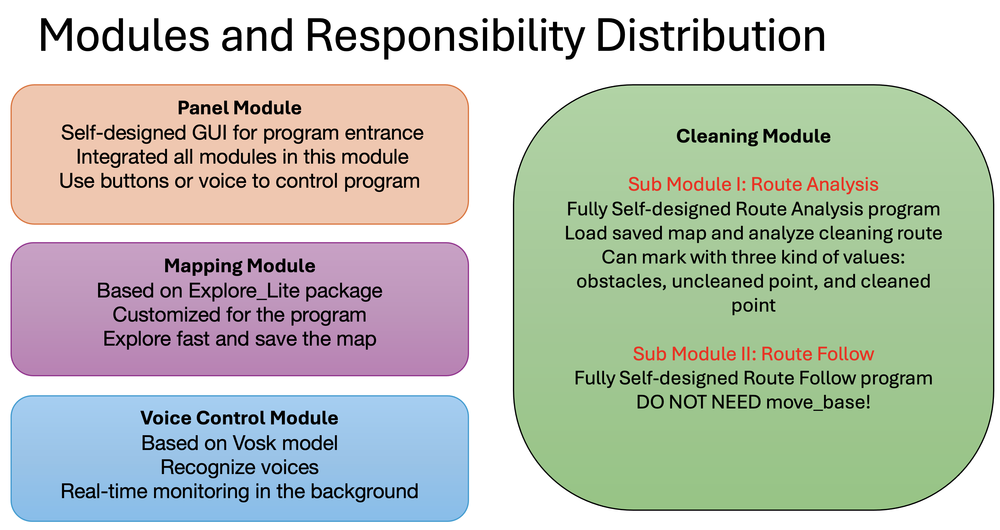

# Smart Cleaning Robot

A growing robot vacuum cleaner project, the goal is to build an open source robot vacuum cleaner project for educational learning.

## The Origin

This project is originally a course project at Brandeis University's Robotics Labs' class. But I think there are much more things beyond the scope inner class. So I took the development part that I developed and continue doing this project.

The original cleaning robot project is based on ROS Noetic and Ubuntu20.04, and use some ROS packages to achieve exploration functions. I designed the cleaning functions, and use AMCL to localize. Now I am modifying some parts, and transfering them into ROS2, and would like to redesign the whole system. The new system in my opinion will have multi-agent collaborations, RL expansion space, etc.

## New SmartCleaningRobot Proposal

Based on previous work, in this new project, I will add following feature:
* Intelligent Agent built in edge device, use Jetson Nano to increase the power.
* DIY exploration and mapping module
* Update cleaning module
* New control panel based on phone
* Connect with other IoT devices

## Version 1 Introduction

Followings are the main prospectives of my development part of previous version finished in school lab.

### Key Features

This is a ROS-based autonomous cleaning robot that integrates indoor mapping, voice control, and innovative cleaning functionalities. This project features expandable modules, making it a valuable tool for research, education, and real-world applications.

**Develope and Test Environment: ROS Noetic, Python3, Ubuntu 20.04.6**

- **GUI Control Panel**: A user-friendly interface to manage all modules without command-line interaction.
- **Voice Control**: Real-time voice recognition for hands-free operation.
- **Mapping**: Efficient exploration and map saving using the Explore_Lite package.
- **Cleaning**: Two cleaning modules for full-coverage path planning, including a fully self-designed solution.

### Demonstration

- Real Demo Link: https://youtu.be/zmo8CKolIh4?si=pPlF57XZn4DD5oo9
- Sim Demo Link: https://youtu.be/rqXiXsVubhQ?si=3jIF6Q37Kqr45SRk

### Problem Statement and Original Objectives

**Background**

With the rise of smart home technology, users now seek cleaning robots with greater autonomy and interactive capabilities beyond basic cleaning. Traditional cleaning robots face significant challenges in dynamic environments, such as avoiding obstacles or adapting to changes in the environment, and often lack the precision needed for complete coverage. This creates a gap in meeting user expectations for intelligent and efficient cleaning experiences.

**Original Objectives**

The project aims to develop a ROS-based cleaning robot that integrates autonomous exploration, complete coverage path planning (CCPP), and voice control. The following objectives were identified to address the problem:

1. **Enable Autonomous Indoor Exploration and Mapping**: Utilize Simultaneous Localization and Mapping (SLAM) and Frontier-Based Exploration (FBE) algorithms to allow the robot to autonomously create a 2D map of an unknown environment.
2. **Design Complete Coverage Path Planning (CCPP)**: Ensure the robot can cover all accessible areas without missing or re-cleaning spaces, achieving efficient and thorough cleaning.
3. **Integrate Real-Time Obstacle Avoidance**: Equip the robot with the ability to detect and avoid dynamic obstacles, such as pedestrians, ensuring smooth and safe cleaning operations.
4. **Build an Intelligent Interaction System**: Develop capabilities to adjust cleaning strategies based on user commands, such as stopping and returning to the base, continuing cleaning, or remapping the environment.
5. **Establish an Expandable System Architecture**: Design the system to be scalable, with interfaces for future module expansions such as mobile app control and smart feedback systems.

**Original Goal**

The overarching goal is to create a smart autonomous cleaning robot that can:

* Quickly explore and map the environment using SLAM and FBE algorithms.
* Plan and execute efficient cleaning routes for complete coverage.
* Recognize and respond to voice commands in real-time.
* Detect and avoid dynamic obstacles during operation.

This solution aims to overcome the limitations of traditional cleaning robots, providing users with a highly autonomous and interactive cleaning experience.

## User Guide

### **Program Entry**

To start the program:

1. **For Simulation**:

  Remember to set localhost settings in ~/.bashrc

```bash
   roslaunch control_panel panel_sim.launch
```

  No additional commands are required for simulation environment, this launch file handles all controls.

2. **For Real Robot**:

  Remember to set real IP settings in ~/.bashrc and update turtlebot3's settings.

  For Real Environment, you need to run roscore on PC firstly:

```bash
roscore
```

  Before bringup, if the environment has no Internet access, or no RTC module on turtlebot3, you need sync time.

  For Real Environment, you need to ssh to turtlebot3 and bring up it secondly:

```bash
$ roslaunch turtlebot3_bringup turtlebot3_robot.launch
```

  After above instructions, you can now run the panel to start the program:

```bash
   roslaunch control_panel panel_real.launch
```

  After running, you must do following to avoid data loss or hardware damage:

```bash
sudo shutdown -h now
```

### Guide for build a test environment

**This is also the environment of final demo at lab**

For the final demonstration at lab, we will replicate a realistic cleaning scenario in a controlled environment. The setup ensures seamless communication and modular scalability, simulating a robust system for future multi-robot collaboration.

**Hardware Configuration:**

* TurtleBot3 (Cleaning Robot)
  * Role: A single cleaning robot performing mapping, exploration, and cleaning tasks.
  * Connectivity: Communicates with the central system via the router's local network.
* No Internet Access Local Network Router (Network Center)
  * Role: Acts as the network center to establish a local LAN for communication.
  * Features: Provides stable IP addresses for devices, enabling consistent communication across the network.
* Computer with Linux OS (Computing Center and Control Terminal):
  * Role: Acts as the central computing tower and the portable control panel
    * Running the GUI control panel, represents portable control panel
    * Managing mapping, exploration, and cleaning processes
    * Collecting and visualizing data in real-time.

## Essential Algorithms (Self Designed)

This part introduces the essential algorithms and techniques built by ourselves.

### Core Algorithms in Route Plan

The route planning in cleaning module II is implemented at a low level and without relying on move_base or other integrated ROS packages. This approach provides more flexibility and control over the cleaning coverage path. The main processing logic is:

1. Map Preprocessing (Dilation Algorithm)
2. Generate Sampling Points (Uniform Sampling)
3. Find Valid Connections (Bresenham's Algorithm)
4. Generate Complete Path (Greedy Algorithm)
5. Visualization & Save (Arrow Path Visualization)

***Note: The codes here are simplified and hide some lines to focus on algorithm ideas.***

#### <1> Dilation Algorithm

- Use the dilation algorithm to expand the obstacle area.
- Calculate the safety distance based on the robot radius.
- Convert the map into a three-value representation: -1 (obstacle), 0 (not visited), 1 (visited).

```python
def preprocess_map(self, map_array):
    processed_map = np.full_like(map_array, MapData.OBSTACLE, dtype=np.int8)
  
    # Set feasible area
    processed_map[map_array == 0] = MapData.UNVISITED
  
    # Expansion processing considering safety distance
    safety_kernel_size = int(2.0 * self.robot_radius / self.grid_resolution)
    safety_kernel = np.ones((safety_kernel_size, safety_kernel_size), np.uint8)
  
    # Inflate obstacles and mark safe areas
    obstacle_map = (processed_map == MapData.OBSTACLE).astype(np.uint8)
    dilated_obstacles = cv2.dilate(obstacle_map, safety_kernel, iterations=1)
    processed_map[dilated_obstacles == 1] = MapData.OBSTACLE
```

#### <2> Uniform Sampling

- Use a fixed interval to uniformly sample the feasible area.
- Convert the sampling point coordinates from grid coordinates to world coordinates.
- Assign a unique ID and status to each sampling point.

```python
def generate_path_points(self, processed_map):
    path_points = []
    height, width = processed_map.shape
    point_id = 0
  
    # Generate waypoints using sampling interval
    for x in range(0, width, self.SAMPLING_INTERVAL):
        for y in range(0, height, self.SAMPLING_INTERVAL):
            if processed_map[y, x] == MapData.UNVISITED:
                world_x, world_y = self.grid_to_world(x, y)
                path_points.append({
                    'id': point_id,
                    'grid_x': x, 'grid_y': y,
                    'world_x': world_x, 'world_y': world_y,
                    'status': MapData.UNVISITED
                })
                point_id += 1
```

#### <3> Bresenham's Algorithm

- Use Bresenham algorithm to generate all grid points between two points.
- Determine pixel position by error accumulation.
- Only use integer operations to improve efficiency.

```python
def get_line_points(self, x1, y1, x2, y2):
    points = []
    dx = abs(x2 - x1)
    dy = abs(y2 - y1)
    x, y = x1, y1
    sx = 1 if x1 < x2 else -1
    sy = 1 if y1 < y2 else -1
  
    if dx > dy:
        err = dx / 2.0
        while x != x2:
            points.append((x, y))
            err -= dy
            if err < 0:
                y += sy
                err += dx
            x += sx
```

#### <4> Greedy Algorithm

- Use a greedy strategy to select the next visit point.
- Prioritize the nearest unvisited point.
- Ensure that the path does not pass through obstacles.
- Handle disconnected areas.

```python
def find_valid_connections(self, path_points):
    connections = []
    visited = set()
    current_point = path_points[0]
    visited.add(0)
  
    while len(visited) < len(path_points):
        best_distance = float('inf')
        best_next_point = None
      
        for i, point in enumerate(path_points):
            if i in visited or not self.are_adjacent(current_point, point):
                continue
            if self.line_crosses_obstacle(current_point, point):
                continue
          
            distance = ((current_point['grid_x'] - point['grid_x']) ** 2 + 
                      (current_point['grid_y'] - point['grid_y']) ** 2) ** 0.5
                    
            if distance < best_distance:
                best_distance = distance
                best_next_point = point
```

#### <5> Arrow Path Visualization

- Use heatmap to display map information.
- Use vector calculation to generate arrow paths.
- Use color mapping to display different states.
- YAML serialization to save path data.

```python
def visualize_plan(self, processed_map, path_points):
    display_map = np.full_like(processed_map, fill_value=1.0, dtype=float)
    display_map[processed_map == MapData.OBSTACLE] = 0.8
  
    plt.imshow(display_map, cmap='gray')
  
    for point in path_points:
        plt.scatter(point['grid_x'], point['grid_y'], c='red', s=30)
  
    connections = self.find_valid_connections(path_points)
    for point1, point2 in connections:
        plt.arrow(point1['grid_x'], point1['grid_y'],
                 point2['grid_x'] - point1['grid_x'],
                 point2['grid_y'] - point1['grid_y'],
                 head_width=2, head_length=2, fc='blue', ec='blue', alpha=0.5)
```

### Core Algorithms in Route Follow

**Process Flow**
Initialization → Load Path Points → Start Route Following Loop:

1. Check localization accuracy
2. Find next target point:
   - Priority: follow planned route order
   - Fallback: find nearest accessible point
3. Check path safety (obstacle avoidance)
4. Move to target point:
   - First rotate to target orientation
   - Then move in straight line
5. Update point status (visited/obstacle)
6. Repeat loop until all points are completed

**Special Features**

1. State Machine

- Uses enumerated states (UNVISITED/VISITED/OBSTACLE) for point tracking
- Enables systematic progress monitoring and recovery

2. Visualization Capabilities

- Real-time display of point status and path connections
- Color-coded visualization for different point states
- Path visualization with directional indicators

3. Real-time Safety Monitoring

- Continuous LiDAR data processing for obstacle detection
- Dynamic path adjustment for obstacle avoidance
- Safety distance maintenance for pedestrian protection
- Configurable safety parameters for different environments

***Note: The codes here are simplified and hide some lines to focus on algorithm ideas.***

#### <1> Localization Accuracy Check

Verifies AMCL positioning accuracy to ensure reliable navigation.

```python
def check_localization_accuracy(self):
    if not self.current_pose:
        return False, "No pose data"
    return True, "Localization accuracy sufficient"
```

#### <2> Target Point Finding

Implements hierarchical point selection strategy - first tries planned route, then falls back to nearest accessible point.

```python
def get_next_planned_point(self, current_point_id):
    for start_id, end_id in self.path_connections:
        if start_id == current_point_id:
            for point in self.path_points:
                if point['id'] == end_id and point['status'] == MapData.UNVISITED:
                    if self.check_path_safety(point) and self.is_point_reachable(point):
                        return point
    return None
```

#### <3> Path Safety Verification

Uses LiDAR data to validate path safety by checking obstacle proximity.

```python
def check_path_safety(self, target_point):
    path_start = np.array([self.current_pose[0], self.current_pose[1]])
    path_end = np.array([target_point['world_x'], target_point['world_y']])
    path_vector = path_end - path_start
  
    danger_points = 0
    for obs_point in self.obstacle_points:
        obs_vector = np.array(obs_point) - path_start
        projection = np.dot(obs_vector, path_vector) / np.linalg.norm(path_vector)
        if 0 <= projection <= np.linalg.norm(path_vector):
            distance = abs(np.cross(path_vector, obs_vector)) / np.linalg.norm(path_vector)
            if distance < self.SAFETY_DISTANCE:
                danger_points += 1
                if danger_points > 5:
                    return False
    return True
```

#### <4> Reachability Check

Determines if target point is within maximum reachable distance.

```python
def is_point_reachable(self, point):
    distance = math.hypot(
        point['world_x'] - self.current_pose[0],
        point['world_y'] - self.current_pose[1]
    )
    return distance < self.MAX_REACHABLE_DISTANCE
```

#### <5> Movement Control

Implements two-phase movement: rotation alignment followed by linear motion.

```python
def move_to_point(self, target_point):
    while not rospy.is_shutdown():
        dx = target_point['world_x'] - self.current_pose[0]
        dy = target_point['world_y'] - self.current_pose[1]
        distance = math.hypot(dx, dy)
        target_angle = math.atan2(dy, dx)
      
        if distance < self.POSITION_TOLERANCE:
            self.stop_robot()
            return True
          
        angle_diff = target_angle - self.current_pose[2]
        if abs(angle_diff) > self.ANGLE_TOLERANCE:
            cmd_vel.angular.z = self.ANGULAR_SPEED if angle_diff > 0 else -self.ANGULAR_SPEED
        else:
            cmd_vel.linear.x = min(self.LINEAR_SPEED, distance)
            cmd_vel.angular.z = 0.5 * angle_diff
```

## Essential Modules

Module Structures:


### **1. Panel Module**

- **Developer**: Pang Liu
- **Description**:
  - Self-designed GUI for controlling all program modules.
  - Provides buttons and voice control integration for seamless operation.
- **Key Features**:
  - Start SLAM, exploration, and cleaning processes.
  - Save and load maps.
  - Route analysis and visualization in RViz.
  - Robot movement control.
  - Developer-friendly logs for debugging.
- Real running illustration:
  - 

**Control Panel Buttons and Functions**

- **Build Map**: Launches SLAM and RViz.
- **Start/Stop Exploration**: Begins or halts autonomous exploration.
- **Save Map**: Saves the current map to the `/maps` directory.
- **Analyze Route**: Uses `route_plan.py` to plan paths based on the saved map.
- **Show Route**: Visualizes the planned route in RViz.
- **Start Cleaning**: Executes the cleaning routine (based on the selected cleaning module).
- **Robot Control**: Allows manual control of the robot via `/cmd_vel`.
- **Quit Program**: Shuts down the system.

### **2. Voice Control Module**

- **Developer**: Pang Liu
- **Description**:
  - Real-time voice recognition using the **Vosk model**.
  - Publishes recognized commands to the `voice_commands` topic.
  - Enables voice-activated control of exploration and cleaning.
- 

### **3. Mapping Module**

- **Developer**: Zhenxu Chen
- **Description**:

  - Based on the **Explore_Lite** package, customized for fast exploration and map saving.
- **Workflow**:

  1. **Start SLAM**: Launches `turtlebot3_slam.launch` for SLAM and RViz.

  - 

  2. **Start Exploration**: Begins autonomous exploration using `explore.launch`.

  - 
  - Visualization Markers:

    - 🔵 Blue Points (Frontier Exploration Markers)
      - Technical Meaning: Valid frontier points indicating unexplored boundaries
      - Simple Description: These points show the boundary between mapped and unmapped areas - like a border between known and unknown territory on a map. They are the potential areas for the robot to explore next.
    - 🔴 Red Points (Frontier Exploration Markers, Not showned on demo)
      - Technical Meaning: Blacklisted frontier points that failed exploration attempts
      - Simple Description: These are "no-go" areas that the robot tried to reach before but couldn't. Think of them like marking an X on a map where there might be obstacles or unreachable spots.
    - 🟢 Green Spheres (Frontier Exploration Markers)
      - Technical Meaning: Initial points of frontiers, with sphere size inversely proportional to frontier cost
      - Simple Description: These balls mark the starting points of unexplored areas. The bigger the ball, the more interesting that area is for exploration - like highlighting the most promising spots on a treasure map.
    - 🟣 Pink Path (Path Planning Markers, 0.05 width)
      - Technical Meaning: Global plan from DWAPlannerROS (/move_base/DWAPlannerROS/global_plan)
      - Simple Description: This is like the overall route plan on a GPS - it shows the complete path the robot plans to take from its current location to its destination.
    - 💛 Yellow Path (Path Planning Markers, 0.03 width)
      - Technical Meaning: Local plan from DWAPlannerROS (/move_base/DWAPlannerROS/local_plan)
      - Simple Description: This is like watching your next few steps carefully - it shows the immediate path the robot plans to take while paying attention to nearby obstacles and adjusting its movement.
  - 
  - 

  3. **Save Map**: Saves the map as `.pgm` and `.yaml` files in the `/maps` directory.

  - 

  4. **Finish Mapping**: Stops SLAM and exploration nodes.

  - 

### **4-1. Cleaning Module I**

- **Developer**: Zhenxu Chen
- **Description**:
  - Based on the **CCPP package** for full-coverage path planning and cleaning.
  - Utilizes `move_base` for navigation.
- Note: `<Cleaning Module I>` is developed at branch `backup`
- CCPP Package: https://wiki.ros.org/full_coverage_path_planner
  - The CCPP package will use saved map to plan a full coverage route and allow the robot following the route.
  - Video: https://drive.google.com/file/d/1F1Hh0JKD9KMvRVsC_EX5ZwptzUVWLEi8/view?usp=drive_link
  - 

### **4-2. Cleaning Module II**

- **Developer**: Pang Liu
- **Description**:
  - Fully self-designed cleaning functionality split into two submodules:
    - **Route Analysis Submodule**:
      - Reads saved maps and analyzes routes using a three-value map (-1 for obstacles, 0 for uncleaned areas, 1 for cleaned areas).
      - Plans paths using sampling intervals and a greedy algorithm to find valid connections.
    - **Route Follow Submodule**:
      - Executes the planned path, marking cleaned areas in real-time (still under debugging).

#### **Sub Module I: Route Analysis**

- **Detailed introduction of `route_plan.py` (core script):**

  1. Get the latest map (map data of `OccupancyGrid` message type) through `/map` topic.

  - 

  2. Convert `OccupancyGrid` data to a grid map represented by a NumPy array.
  3. Perform obstacle expansion on the map (taking into account the safety distance of the robot).

  - 

  4. **Generate a three-value map**: `-1`, `0`, and `1` are used to represent obstacles, unvisited areas, and visited areas respectively.
  5. Generate path points in the map through a fixed sampling interval. Each path point includes world coordinates and grid coordinates.
  6. Use **greedy algorithm** to find valid connections between path points and check whether there are obstacles between two points.

  - 
- **After the connection is completed:**

  - Use `matplotlib` to draw the path points and connected line segments and save them as an image.
  - **The logic of finding valid connections:**
    - Each path point can only be connected to the path points adjacent to it.
    - **Definition of connection:** up, down, left, and right.
    - Isolated path points are not considered in the connection.
  - Use RViz and route_show (button [Show Route]) to see the points and route:
  - 
  - 

#### **Sub Module II: Route Follow**

- **Main Logic**

  - (1) Follow the route based on route_plan analyzed
  - (2) When reach a red point, that point will turn to green
  - (3) If the robot found the red point is not reachable, might be a wall, might be a moving obstacle, then the point will turn to black.
- The full logic of `route_follow.py`:

  - 
- **black point demo:**

  - 
- **red point turn to green point demo:**

  - 
  - 

---

## Codes and Files Explanations

### Directory Structures


*Note: The Cleaning Module I (CCPP) is not in branch `master`, please see its implementation in branch `backup`. For this project final demonstration, we mainly use our self designed Cleaning Module II.*

### Directory and Scripts Table

| Folder/File                                 | Description                             | Topics and Messages                      |
| ------------------------------------------- | --------------------------------------- | ---------------------------------------- |
| maps/                                       | Store map files built by mapping module |                                          |
| src/                                        | Main source code directory              |                                          |
| ├── cleaning_bot/                        | Explore lite package files              |                                          |
| ├── control_panel/                       | Control panel directory                 |                                          |
| │   ├── launch/                         | Launch file directory                   |                                          |
| │   │   ├── panel_real.launch          | Program entrance in real environment    |                                          |
| │   │   ├── panel_sim.launch           | Program entrance in simulation          |                                          |
| │   └── src/                            |                                         |                                          |
| │   │   ├── control_panel_gui.py       | Main control panel program scripts      | Subscribe: /voice_commands               |
| │   │   │                                |                                         | Publish: /cmd_vel                        |
| │   │   │                                |                                         | Publish: /control_move_base              |
| │   │   │                                |                                         | Publish: /control_explore                |
| │   │   │                                |                                         | Publish: /control_gmapping               |
| │   │   │                                |                                         | Publish: /control_amcl                   |
| │   │   │                                |                                         | Publish: /control_route_show             |
| │   │   │                                |                                         | Publish: /control_route_follow           |
| │   │   ├── voice_vosk.py              | Voice recognition program               | Subscribe: control commands              |
| │   │   │                                |                                         | Publish: /voice_commands                 |
| │   │   ├── SLAM_controller.py         | SLAM controller                         | Subscribe: /control_gmapping             |
| │   │   ├── AMCL_controller.py         | AMCL controller                         | Subscribe: /control_amcl                 |
| │   │   ├── move_base_controller.py    | Move base controller                    | Subscribe: /control_move_base_controller |
| │   │   ├── explore_controller.py      | Exploration controller                  | Subscribe: /control_explore              |
| │   │   ├── controller_route_show.py   | Route display controller                | Subscribe: /control_route_show           |
| │   │   ├── controller_route_follow.py | Route following controller              | Subscribe: /control_route_follow         |
| │   │   └── vosk-model-small-en-us/    | Voice recognition model files           |                                          |
| ├── simulation_world/                    | Simulation environment directory        |                                          |
| ├── sweep/                               | Core cleaning directory                 |                                          |
| │   ├── config/                         | RViz configuration files                |                                          |
| │   ├── debug/                          | Processed map files                     |                                          |
| │   ├── pathfiles/                      | Path information files                  |                                          |
| │   └── src/                            |                                         |                                          |
| │   │   ├── route_map_server.py        | Supporting files for following scripts  |                                          |
| │   │   ├── route_plan.py              | Route planner                           | Subscribe: /map topic                    |
| │   │   ├── route_show.py              | Route visualization                     | Publish: /path_visualization             |
| │   │   │                                |                                         | Publish: /path_connections               |
| │   │   └── route_follow.py            | Route following program                 | Subscribe: /amcl_pose                    |
| │   │   │                                |                                         | Subscribe: /scan                         |
| │   │   │                                |                                         | Publish: /cmd_vel                        |
| │   │   │                                |                                         | Publish: /route_status                   |
| │   │   │                                |                                         | Publish: /route_status_visualization     |
| │   │   │                                |                                         | Publish: /current_path                   |
| └── turtlebot3/                          | Turtlebot3 core files                   |                                          |

## The hardware implementation

I build a turtlebot3 and install a logi USB camera on it. The image processing is finished via a script using OpenCV.

***The turtlebot3 I built:***


## Relevant Literature and References

Related research, tutorial and reference for algorithms:

- Frontier Based Exploration: chrome-extension://efaidnbmnnnibpcajpcglclefindmkaj/https://arxiv.org/pdf/1806.03581
- Dilation Algorithm: https://homepages.inf.ed.ac.uk/rbf/HIPR2/dilate.htm
- Greedy Algorithm: https://en.wikipedia.org/wiki/Greedy_algorithm
- Bresenham's Line Algorithm: https://en.wikipedia.org/wiki/Bresenham%27s_line_algorithm
- Mapping, localization and planning: chrome-extension://efaidnbmnnnibpcajpcglclefindmkaj/https://gaoyichao.com/Xiaotu/resource/refs/PR.MIT.en.pdf

Technical reference for integration and structures:

- ROS Frontier Exploration: https://wiki.ros.org/frontier_exploration
- ROS Explore Lite: https://wiki.ros.org/explore_lite
- VOSK: https://alphacephei.com/vosk/
- ROS Full Coverage Path Planning: https://wiki.ros.org/full_coverage_path_planner
- Turtlebot3: https://emanual.robotis.com/
- OpenCV: https://opencv.org/
